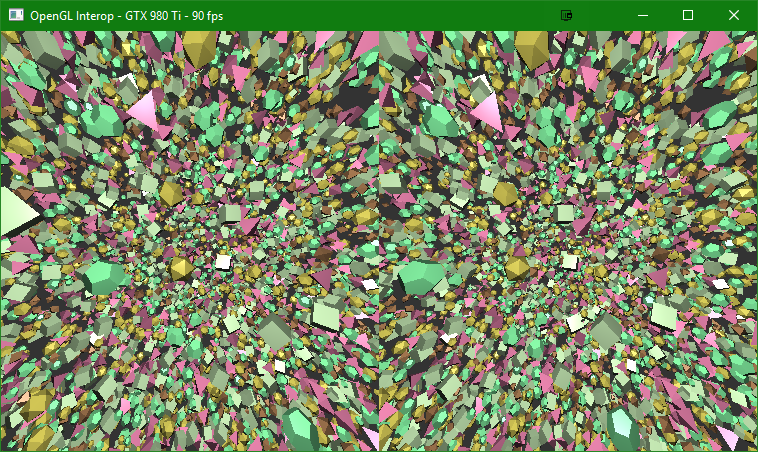

## VR Examples

Interaction with Oculus or OpenVR SDKs.  Both of these examples use a 
[common base class](examples/windows/vr_common.hpp) which runs builds an 
offscreen renderer to do all the common rendering tasks.  It's up to the 
individual derived class to properly fetch recommended offscreen texture 
size, as well as the projection and view matrices from the VR API.  

### [Oculus SDK Usage](examples/windows/vr_oculus.cpp)

Demonstrates using the Oculus SDK with an offscreen Vulkan renderer to create images 
which are then passed to an the SDK for display on an HMD
  

### [OpenVR SDK Usage](examples/windows/vr_openvr.cpp)

Demonstrates using the OpenVR SDK with an offscreen Vulkan renderer to create images 
which are then passed to an the SDK for display on an HMD
  